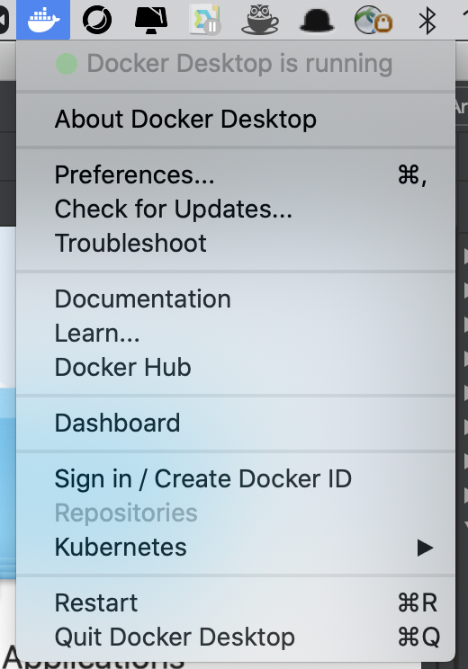

<!-- SPDX-License-Identifier: CC-BY-4.0 -->
<!-- Copyright Contributors to the ODPi Egeria project 2020. -->

# Docker and DockerHub

**Docker** is a [simple container runtime and standard](https://www.docker.com/why-docker).
Every day, the egeria build processing creates
a docker container of egeria and pushes it to the docker catalog on the **Docker website**.

This docker container provides a simple way to bring a runnable version of Egeria onto your
machine.  It also provides the basis for a [Kubernetes](Kubernetes.md) deployment
of Egeria.

The docker catalog page for egeria is at
[https://hub.docker.com/r/odpi/egeria](https://hub.docker.com/r/odpi/egeria).
The **Overview** tab describes the docker container.


The **Tags** tab shows the different releases that are available.


## Prerequisites - getting the docker runtime

The docker container needs a runtime to execute.  It can run in the cloud using **Docker Hub** or
on your machine using the **Docker Desktop**. 
The description below describes how to use the docker desktop.

Go to the [Docker website](https://www.docker.com/why-docker) and select
the **Download Docker Desktop**.


Follow the instructions for you operating system.  For macOS, the docker desktop
is installed like a standard application.


Once the desktop is installed, start the docker desktop application.
It may take a little while to complete its start up so check it is running before continuing.

For example, on macOS, the docker desktop can be found on the **Launchpad**. Once it is running,
the docker whale icon appears on the top menu bar.  Clicking on the docker whale icon reveals a menu
and the status of the desk top is visible. 
This menu is used to shutdown docker at the end of the dojo.



## Downloading the egeria docker container

The command to download Egeria's docker container is `docker pull odpi/egeria`.
This is issued from a command/terminal window in the directory where you want the
container to be copied to.

If you see the following response, then the docker runtime is not installed properly on your machine.

```bash
$ docker pull odpi/egeria
-bash: docker: command not found
```

If all is well, the container downloads.  Notice it is pulling the latest master build.

```bash
$ docker pull odpi/egeria
Using default tag: latest
latest: Pulling from odpi/egeria
e7c96db7181b: Pull complete 
f910a506b6cb: Pull complete 
b6abafe80f63: Pull complete 
a83b87485b54: Pull complete 
10d9ee7d5688: Pull complete 
9558171b7a95: Pull complete 
Digest: sha256:18451a4676a6688e03f284f887ba5be7026c17805ee0b919ed02cb131621d45b
Status: Downloaded newer image for odpi/egeria:latest
docker.io/odpi/egeria:latest
$
```
To check it will run, try the `docker run --publish 18080:8080 odpi/egeria`.
This will start the docker container and a single copy of the
[OMAG Server Platform](../../open-metadata-implementation/admin-services/docs/concepts/omag-server-platform.md).
The OMAG Server Platform is the Egeria runtime platform where the Egeria REST services run.

The `--publish 18080:8080` parameter maps the 8080 port inside the docker that the OMAG Server Platform
has registered with to port 18080

You should see the server logo come up and finally a message 
`OMAG server platform ready for more configuration`.  This message means it has successfully started.

Once you can see that it has started, use `Control-C` to stop it.

```bash
$ docker run --publish 18080:8080 odpi/egeria
Picked up JAVA_TOOL_OPTIONS: 
 ODPi Egeria
    ____   __  ___ ___    ______   _____                                 ____   _         _     ___
   / __ \ /  |/  //   |  / ____/  / ___/ ___   ____ _   __ ___   ____   / _  \ / / __    / /  / _ /__   ____ _  _
  / / / // /|_/ // /| | / / __    \__ \ / _ \ / __/| | / // _ \ / __/  / /_/ // //   |  / _\ / /_ /  | /  _// || |
 / /_/ // /  / // ___ |/ /_/ /   ___/ //  __// /   | |/ //  __// /    /  __ // // /  \ / /_ /  _// / // /  / / / /
 \____//_/  /_//_/  |_|\____/   /____/ \___//_/    |___/ \___//_/    /_/    /_/ \__/\//___//_/   \__//_/  /_/ /_/

 :: Powered by Spring Boot (v2.3.0.RELEASE) ::


Thu May 21 15:47:20 GMT 2020 No OMAG servers listed in startup configuration
Thu May 21 15:47:27 GMT 2020 OMAG server platform ready for more configuration
^C
$
```

# Working with the Docker Desktop Dashboard

The docker desktop **dashboard** makes it easy to control your docker containers.
It is started from the docker desktop menu.  Select the `Dashboard` option.
You will see something like this:


When docker desktop is first instoaaled
Once you have run a docker container once


----
* Return to [Developer Tools](.)


* Link to [Egeria's Community Guide](../../Community-Guide.md)
* Link to the [Egeria Dojo Education](../../open-metadata-resources/open-metadata-tutorials/egeria-dojo)


----
License: [CC BY 4.0](https://creativecommons.org/licenses/by/4.0/),
Copyright Contributors to the ODPi Egeria project.