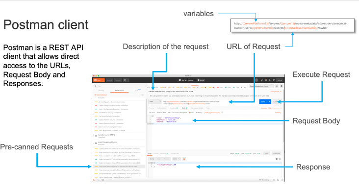

<!-- SPDX-License-Identifier: CC-BY-4.0 -->
<!-- Copyright Contributors to the ODPi Egeria project 2020. -->

# Postman

[Postman](https://www.postman.com/) is an interactive tool for calling REST APIs.
The Egeria community uses postman for demos and education as well as testing APIs
during development.

This is an illustration of the Postman user interface:

## Installing Postman

Postman can be downloaded and installed from this link: 
 * [https://www.getpostman.com/downloads/](https://www.getpostman.com/downloads/). 

The installation instructions for Postman are found here: 
 * [https://learning.getpostman.com/docs/postman/launching_postman/installation_and_updates/](https://learning.getpostman.com/docs/postman/launching_postman/installation_and_updates/)
 
Once Postman is installed it can be started like any other desktop application.

Egeria by default uses https:// requests with a self-signed certificate. Any PostMan users therefore will need to
go into settings->general and turn off 'SSL certificate verification' or requests will fail.

## Next steps

If you are working through the Egeria Dojo, you can
return to the guide for [Day 1 of the Egeria Dojo](../../open-metadata-resources/open-metadata-tutorials/egeria-dojo/egeria-dojo-day-1-3-1-1-platform-set-up-prerequisites.md).

If you are only interested in learning more about Postman, consider the [Postman tutorial](../../open-metadata-resources/open-metadata-tutorials/postman-tutorial).

If you would like to create and contribute postman collections, there are instructions
in the [developer resources](../Postman-Samples.md).

----
* Return to [Developer Tools](.)

* Link to [Egeria's Community Guide](../../Community-Guide.md)
* Link to the [Egeria Dojo Education](../../open-metadata-resources/open-metadata-tutorials/egeria-dojo)

----
License: [CC BY 4.0](https://creativecommons.org/licenses/by/4.0/),
Copyright Contributors to the ODPi Egeria project.
