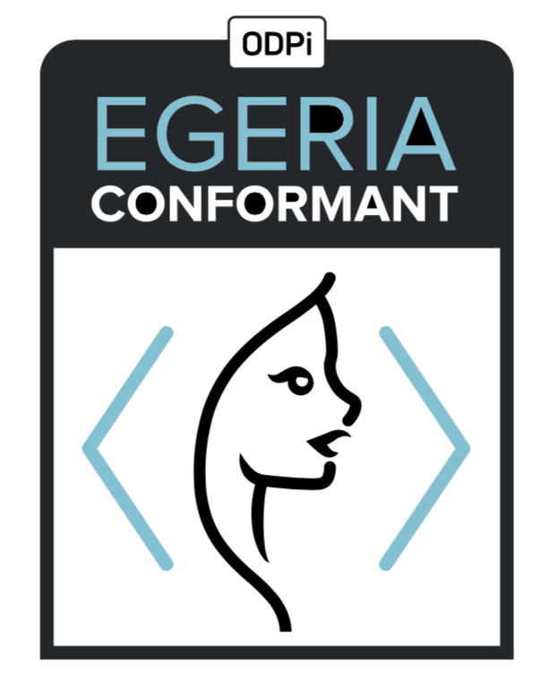

<!-- SPDX-License-Identifier: CC-BY-4.0 -->
<!-- Copyright Contributors to the ODPi Egeria project. -->

# Open Metadata Conformance Suite

The open metadata conformance suite provides a testing framework to help the developers
integrate a specific technology into the open metadata ecosystem.

Since there are different APIs and event topics that can be used to integrate into the open metadata
ecosystem, so there are different suites of tests to exercise that integration point.
Each suite of tests are managed and executed by a **workbench**. 

The initial focus of the conformance suite is on the
behavior of an open metadata repository and the OMAG Platform.
There is a dedicated workbench for each of these test focuses:

* **[Platform Workbench](docs/platform-workbench)** - which tests the REST API of an
[Open Metadata and Governance (OMAG) Server Platform](../open-metadata-implementation/admin-services/docs/concepts/omag-server-platform.md)

* **[Repository Workbench](docs/repository-workbench)** - which tests both the repository services 
[REST API](../open-metadata-implementation/repository-services/docs/component-descriptions/omrs-rest-services.md)
and [event exchange](../open-metadata-implementation/repository-services/docs/event-descriptions)
of an [open metadata repository](../open-metadata-implementation/repository-services/docs/open-metadata-repository.md).

Future test suites will cover other APIs and event types as well
demonstrate the ability to handle various workloads and also
a performance benchmark test.

Each workbench defines a set of profiles that a technology can support.  Within each profile are a list of requirements,
some are mandatory and some are required.  If the technology passes all of the mandatory requirements defined in the
profiles then it is considered compliant.  Extra credit is then given to supporting the optional requirements.
The aim of the mandatory requirements is to ensure the technology can *do no harm* to the other technologies it
is sharing metadata with.

Any technology that can demonstrate that it is conformant can apply to the ODPi for permission to display
the conformance mark in their product/descriptive literature (see below).

More details on the conformance mark can be found on the [ODPi Website](https://www.odpi.org/projects/egeria/conformance).

Information on how to run the open metadata conformance suite is located in the [docs section](docs).
The internal design is described in the [design section](design).

----
Return to [home page](../index.md).

----
License: [CC BY 4.0](https://creativecommons.org/licenses/by/4.0/),
Copyright Contributors to the ODPi Egeria project.

