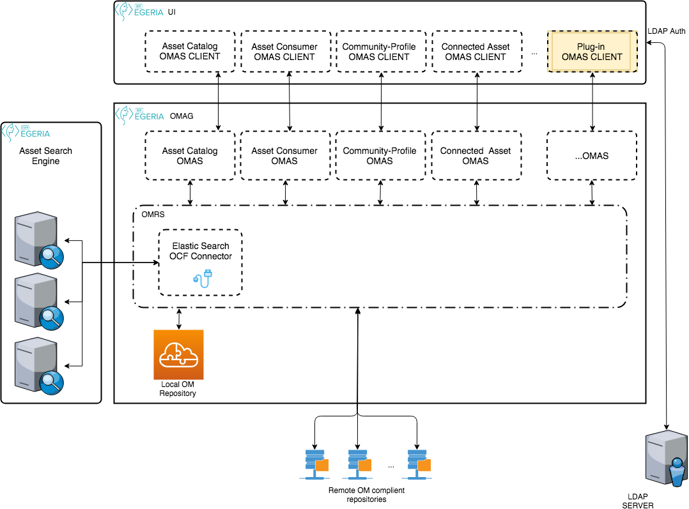

<!-- SPDX-License-Identifier: CC-BY-4.0 -->
<!-- Copyright Contributors to the ODPi Egeria project. -->

# Asset Catalog Open Metadata Access Service (OMAS)

The Asset Catalog OMAS provides services to search for data assets including:

* data stores
* event feeds
* APIs
* data sets

The search will locate assets
based on the content of the Asset metadata itself and the metadata that links
to it.  This includes:

* glossary terms
* schema elements
* classifications

The Asset Catalog REST API supports:

* the retrieval of assets based on unique identifiers
* the retrieval of asset's relationships and classifications
* the retrieval of assets based on known classification or relationship
* to query for related assets and to retrieve an asset neighborhood

The module structure for the Asset Catalog OMAS is as follows:

* [asset-catalog-client](asset-catalog-client) supports the client library.
* [asset-catalog-api](asset-catalog-api) supports the common Java classes that are used both by the client and the server.
* [asset-catalog-server](asset-catalog-server) supports in implementation of the access service and its related event management.
* [asset-catalog-spring](asset-catalog-spring) supports the REST API using the [Spring]__(../../../developer-resources/Spring.md)__ libraries.

###Search solution
The search will return Assets and Glossary terms that match the search criteria.
As the asset search is to be performed against on one or more repositories a search engine will be used. 
The search will be performed using name/displayName, descriptions and qualifiedName of the asset and/or Glossary terms.
Indexing will be performed by the Asset Catalog OMAS according to supported zones.
The search result will contain: guid, name (name or displayName), description, qualifiedName, classifications, zoneMembership.
    

> Figure 1:Integration of search engine