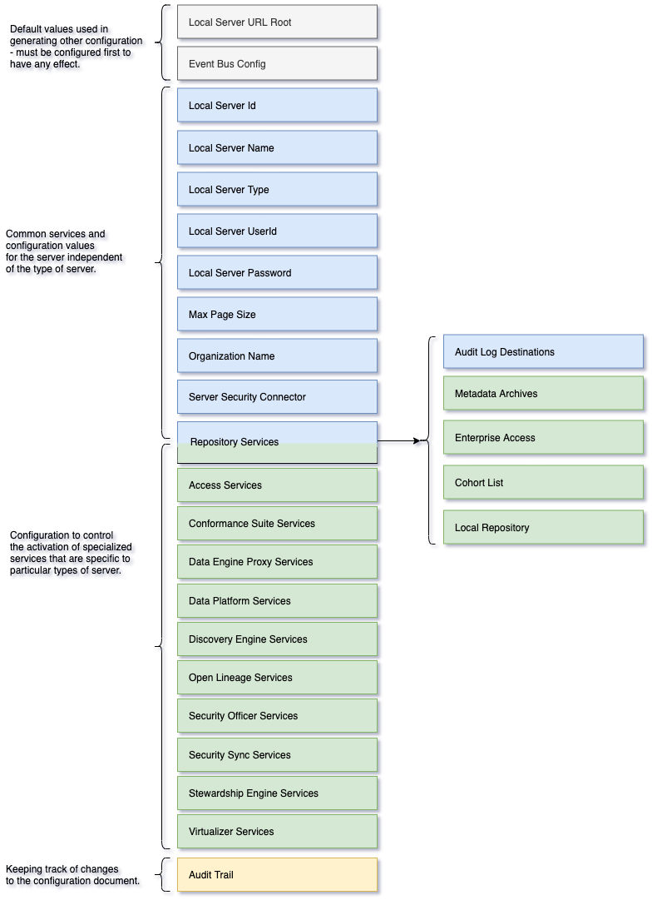

<!-- SPDX-License-Identifier: CC-BY-4.0 -->
<!-- Copyright Contributors to the ODPi Egeria project. -->

# Configuration Documents

A configuration document provides the configuration parameters for a single
[OMAG Server](omag-server.md).
It is structured into elements that each describe the
configuration properties of an aspect of the OMAG Server.

Figure 1 provides more details.

> **Figure 1:** Structure of the configuration document

The sections are as follows:

* Common default values to use when creating other configuration elements.
* Basic properties of any OMAG server.
* Configuration for specific subsystems.
* Audit trail that documents the changes that have been made to the configuration document.

## Default Values

At the top are **Local Server URL Root** and **Event Bus Config**.
Both of these elements provide default values for other configuration
elements.

If they are changed in the configuration document, their new values
do not affect existing definitions in the configuration document.

## Storage of the configuration document

By default the configuration document are stored as JSON in a file in the default directory
for the [OMAG Server Platform](omag-server-platform.md) that creates them.

These files may contain security certificates and passwords and so should be treated as sensitive.
It is possible to change the storage location of configuration documents
using the `{serverURLRoot}/open-metadata/admin-services/users/{userId}/stores/connection` API.
This passes in a connection used to create the connector to the configuration document storage.

If this connection is not set up, the OMAG Server platform defaults to the JSON file store.

## Further reading

* [OMAG Server](omag-server.md) - different types of OMAG servers and how they are configured.
* [Open Connector Framework (OCF)](../../../frameworks/open-connector-framework) -
to understand more abut open connectors and connections.

----
License: [CC BY 4.0](https://creativecommons.org/licenses/by/4.0/),
Copyright Contributors to the ODPi Egeria project.