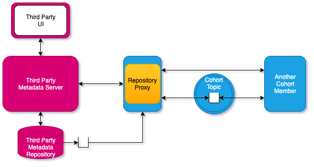

<!-- SPDX-License-Identifier: CC-BY-4.0 -->
<!-- Copyright Contributors to the ODPi Egeria project. -->

# Repository Proxy

A repository proxy is an [OMAG Server](omag-server.md) that has been configured to
act as a proxy to a third party metadata repository.
It is used by a technology that is integrating using the
[Adapter Integration Pattern](../../../../open-metadata-publication/website/open-metadata-integration-patterns/adapter-integration-pattern.md).

Figure 1 shows the repository proxy operating.

> **Figure 1:** Repository proxy translating between third party APIs/events and open metadata

There are two repository proxy implementations included with Egeria

* [Repository Proxy for Apache Atlas](https://github.com/odpi/egeria-connector-apache-atlas)
* [Repository Proxy for IBM Information Governance Catalog (IGC)](https://github.com/odpi/egeria-connector-ibm-information-server)

## Configuring a Repository Proxy

The tasks for configuring an repository proxy are as follows:

* [Setting up the default event bus](../user/configuring-event-bus.md)
* [Configuring the default local server URL root](../user/configuring-local-server-url.md)
* [Setting basic properties for an OMAG server](../user/configuring-omag-server-basic-properties.md)
* [Configuring the audit log destinations](../user/configuring-the-audit-log.md)
* [Configuring the server security connector](../user/configuring-the-server-security-connector.md)
* [Configuring registration to a cohort](../user/configuring-registration-to-a-cohort.md)
* [Configuring the open metadata archives loaded at server start](../user/configuring-the-startup-archives.md)
* [Configuring the repository proxy connectors](../user/configuring-the-repository-proxy-connector.md)

----
Return to [Cohort Members](cohort-member.md).

----
License: [CC BY 4.0](https://creativecommons.org/licenses/by/4.0/),
Copyright Contributors to the ODPi Egeria project.