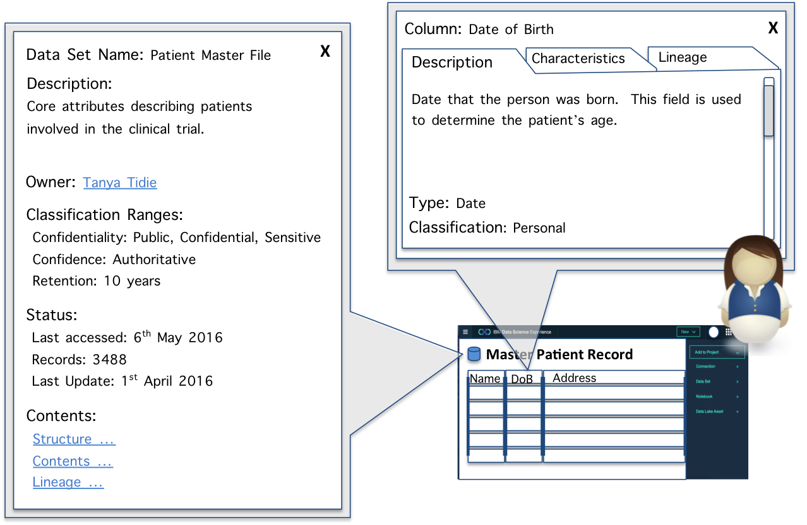

<!-- SPDX-License-Identifier: Apache-2.0 -->

# Access Services User Interface

The Access Services User Interface provides a user interface that supports
the user-facing open metadata access services.  It is a role-based UI that
offers different capabilities based on the end user's role.  This makes it
useful for demonstrations.

## Catalog Search

One of the important reasons for managing metadata about data assets is the
ability for individuals to search and locate the data they need to make new uses
of an organization's data.
The metadata describes the location, structure and content of the data to
varying degrees of detail.
By bringing the metadata for data assets from across the enterprise,
an organization is able to manage and use this data more effectively.

Collectively, the open metadata repositories should bring together all of
the knowledge the organization has about each data source in order
to have enough information to differentiate between them during the data selection process.

Figure 1 below shows the types of information about a data source that should
be available through the the open metadata repositories. 
 

> Figure 1: Drill-down from catalog search results to explore the content and qualities of a data set

This metadata is returned by the connector whose connection is lined to the retrieved asset.
The connector is created by the 
**[Asset Consumer OMAS](../../../open-metadata-implementation/access-services/asset-consumer)**.

----
License: [CC BY 4.0](https://creativecommons.org/licenses/by/4.0/),
Copyright Contributors to the ODPi Egeria project.