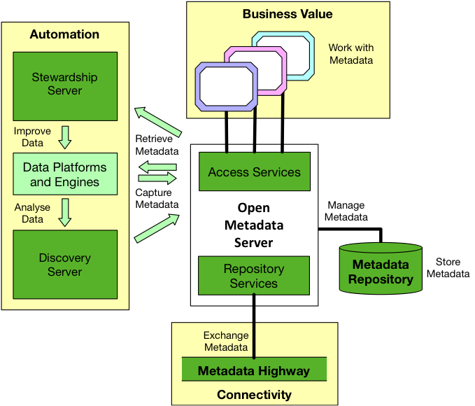

<!-- SPDX-License-Identifier: CC-BY-4.0 -->
<!-- Copyright Contributors to the ODPi Egeria project. -->
  
# What is ODPi Egeria?

Egeria creates a set of open APIs, [types](open-metadata-types/README.md)
and interchange protocols to allow all metadata repositories
to share and exchange metadata.

From this common base, it adds governance,
discovery and access frameworks to automate the collection, management and
use of metadata across an enterprise.  The result is an enterprise catalog of
data resources that are transparently assessed, governed and used in order to
deliver maximum value to the enterprise.

Delivering this capability as open source is a critical part of the project
since multiple vendors must buy into this ecosystem.
They are not going to do this if one organization dominates the technology base.
Thus the open metadata and governance technology must be freely available with
an open source governance model that allows a community of organizations and
practitioners to develop and evolve the base and then use it in their offerings
and deployments.

# Project Objectives

Figure 1 summarizes the objectives of the new open metadata and
governance function for Egeria:
**Automation**, **Business Value** and **Connectivity**.

> Figure 1: The ABC of open metadata and governance

* **Automation**
Open metadata and governance provides an API for components that capture
metadata from data platforms as data sources are created and changed.
This metadata is stored in the metadata repository and results in notifications
to alert governance and discovery services about the new/changed data source.
It provides frameworks and servers to host bespoke components that automate the
capture of detailed metadata and the actions necessary to govern data and its
related assets.  This includes: 
  * A discovery server that manages discovery services for analyzing and
  capturing metadata about new data sources.
  * A stewardship server that manages stewardship services for resolving
  issues detected during the governance and use of data.

* **Business Value** 
Open metadata and governance provides specialized access services and user interfaces
for key data roles such as CDO, Data Scientist, Developer, DevOps Operator,
Asset Owner, and for Applications.  This enables metadata to directly support the work
of people in the organization.
The access services can also be used by tools from different vendors to deliver
business value with open metadata.

* **Connectivity**
Finally, connectivity enables a peer-to-peer Metadata Highway offering
open metadata exchange, linking and federation between
heterogeneous metadata repositories.

# Technical Components 

The open metadata and governance project is divided into the following pieces:
* **[Common types for open metadata](open-metadata-types/README.md)** - these types are built from the Egeria type system and define the types stored in the graph database as well as payloads for notifications and APIs.
* **[Open Metadata Repository Services (OMRS)](../../open-metadata-implementation/repository-services/README.md)** - Open metadata repository APIs and notifications to enable metadata repositories to exchange metadata in a peer-to-peer metadata repository cohort.  This capability is located in each metadata repository and collectively they enable what is referred to as the "metadata highway".
* **[Open Metadata Access Services (OMAS)](../../open-metadata-implementation/access-services/README.md)** - Consumer-centric APIs and notifications for specific classes of tools and applications.  The OMAS services call the OMRS to access metadata from any open metadata repository.
* New frameworks:
  * **[Open Connector Framework (OCF)](../../open-metadata-implementation/frameworks/open-connector-framework/README.md)** - provides factories for connectors with access APIs for data resources and metadata together.  The OMRS is also built as a set of metadata repository connectors and the OMAS services use the OCF to connect to the appropriate OMRS connector.
  * **[Open Discovery Framework (ODF)](../../open-metadata-implementation/frameworks/open-discovery-framework/README.md)** - provides management for automated processes and analytics to analyze the content of data resources and update the metadata about them.
  * **[Governance Action Framework (GAF)](../../open-metadata-implementation/frameworks/governance-action-framework/README.md)** - provides audit logging and governance enforcement services for implementing enforcement points in data engines, security managers such as Apache Ranger, and APIs.  It also adds stewardship services for analyzing audit logs and resolving issues identified in exceptions raised by the enforcement services.
* **[Open Metadata Graph Repository](../../open-metadata-implementation/adapters/open-connectors/repository-services-connectors/open-metadata-collection-store-connectors/graph-repository-connector/README.md)** - A set of stores linked together with a graph database.  These stores provide linkage between business, technical and operational metadata along with logs for auditing, operational lineage, metering and exception management.
* **Open Lineage Services** - Services for collecting and querying lineage information across multiple heterogeneous metadata repositories.

At this current time, there is a huge investment into Egeria
to add the open metadata and governance features plus also work on
adoption of this technology across the data industry.

# Integrating into the Open Metadata and Governance Ecosystem

With these frameworks and APIs in place,
the Egeria function is divided into different packages to allow technology partners
to connect into the open metadata and governance ecosystem.
The integration options are described as five patterns
([native, caller, adapter, plug-in, special](open-metadata-integration-patterns/README.md)).

----
License: [CC BY 4.0](https://creativecommons.org/licenses/by/4.0/),
Copyright Contributors to the ODPi Egeria project.
