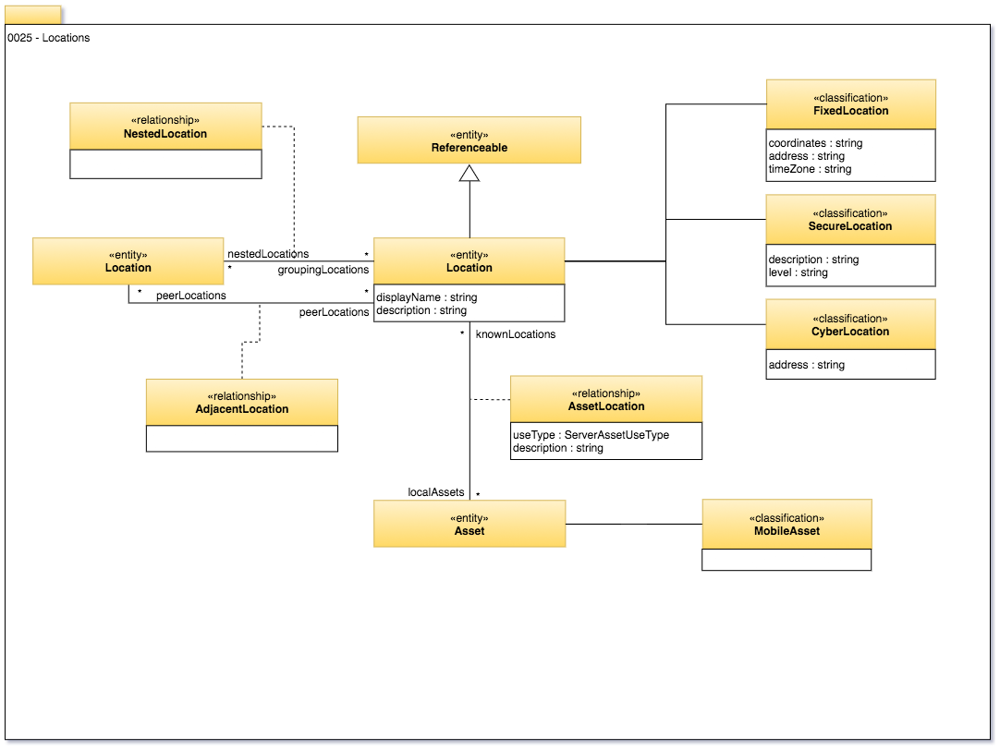

<!-- SPDX-License-Identifier: CC-BY-4.0 -->
<!-- Copyright Contributors to the ODPi Egeria project. -->

# 0025 Locations

It is important to understand where assets are located to ensure they
are properly protected and comply with data sovereignty laws.
The open metadata model allows location information to be captured
at many levels of granularity.

The NestedLocation relationship allows hierarchical groupings of locations
to be represented.
Notice that locations can be organized into multiple hierarchies.

The AdjacentLocation relationship links locations that touch one another.

The notion of a location is variable and the classifications FixedLocation,
SecureLocation and CyberLocation help to clarify the nature of the location.

* FixedLocation means that the location represents a physical place where, for example, Hosts (see 0030 below), servers (see 0040 below) and hence data may be located.  This could be an area of a data center, the building the data center is located in, or even the country where the server/data is located.
* SecureLocation indicates that there is restricted access to the location.
* CyberLocation means that the location describes something in cyber space.

----
License: [CC BY 4.0](https://creativecommons.org/licenses/by/4.0/),
Copyright Contributors to the ODPi Egeria project.