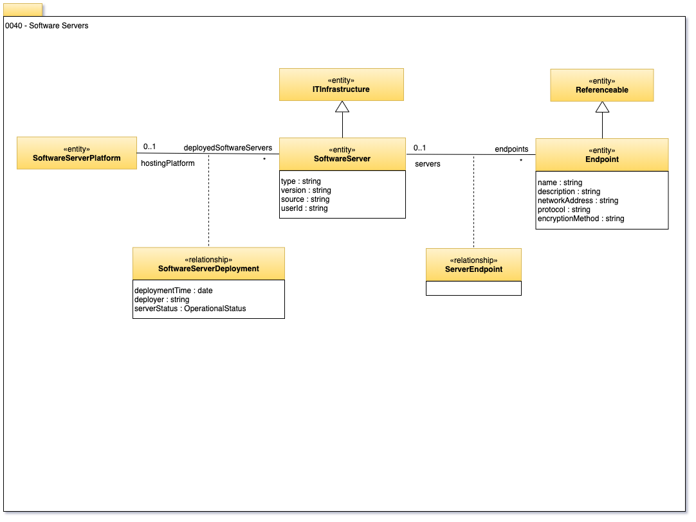

<!-- SPDX-License-Identifier: CC-BY-4.0 -->
<!-- Copyright Contributors to the ODPi Egeria project. -->

# 0040 Software Servers

Software servers describe the middleware software servers
(such as application servers, data movement engines and database servers)
that run on the Hosts.
Within the software server model we capture its userId that it operates under.
Most metadata repositories are run in a secure mode requiring
incoming requests to include the requester’s security credentials.
Therefore we have an identifier for each unique logged on security identity
(aka userId).
This identity is recorded within specific entities and relationships
when they are created or updated.
By storing the user identifier for the server, it is possible to
correlate the server with the changes to the metadata
(and related data assets) that it makes. 

See model 0110 Actors in Area 1 for details of how user identifiers
are correlated with people and teams).

Open metadata may also capture the network endpoint(s) that the server
is connected to and the host it is deployed to.

The endpoint defines the parameters needed to connect to the server.
It also features in the Connection model (0201 in Area 2) used by
applications and
tools to call the server.
Thus through the endpoint entity it is possible to link the
connection to the underlying server.

Within the server are many capabilities.
These range from full applications (see 0240 in Area 2)
to security plugins to logging and encryption libraries.
Different organizations and tools can choose the granularity
in which the capabilities are captured in order to provide appropriate
context to data assets and the decisions made around them.

----
License: [CC BY 4.0](https://creativecommons.org/licenses/by/4.0/),
Copyright Contributors to the ODPi Egeria project.