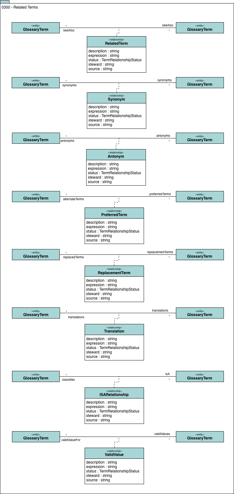

<!-- SPDX-License-Identifier: CC-BY-4.0 -->
<!-- Copyright Contributors to the ODPi Egeria project. -->

# 0350 Related Terms

The Related Terms model contains relationships used to show how the meanings of different terms are related to one another.

The **TermRelationshipStatus** defines how reliable the relationship is between two glossary terms:

* DRAFT means the relationship is under development.
* ACTIVE means the relationship is validated and in use.
* DEPRECATED means the the relationship is being phased out.
* OBSOLETE means that the relationship should not be used anymore.
* OTHER means that the status is not one of the statuses listed above.  The description field can be used to add more details.

The related term relationships are as follows:

* **RelatedTerm** is a relationship used to say that the linked glossary term may also be of interest.
It is like a "see also" link in a dictionary.
The description field can be used to explain why the linked term is of interest.
* **Synonym** is a relationship between glossary terms that have the same, or a very similar meaning.
* **Antonym** is a relationship between glossary terms that have the opposite (or near opposite) meaning.
* **PreferredTerm** is a relationship that indicates that the preferredTerm should be used in place of the preferredToTerm. 
* **ReplacementTerm** is a relationship that indicates that the replacementTerm must be used instead of the replacedByTerm.
This is stronger version of the PreferredTerm.
* **Translation** is a relationship that defines that the related terms represent the same meaning but each are written in a different language.
Hence one is a translation of the other.  The language of each term is defined in the Glossary object that anchors the term.
* **IsA** is a relationship that defines that the "isA" term is a more generic term than the "isOf" term.
For example, this relationship would be use to say that "Cat" ISA "Animal".
* **ValidValue** is a relationship that shows the validValue term represents one of the valid values that could be assigned to a data item that has the meaning described in the **validValueFor** term.

----
License: [CC BY 4.0](https://creativecommons.org/licenses/by/4.0/),
Copyright Contributors to the ODPi Egeria project.