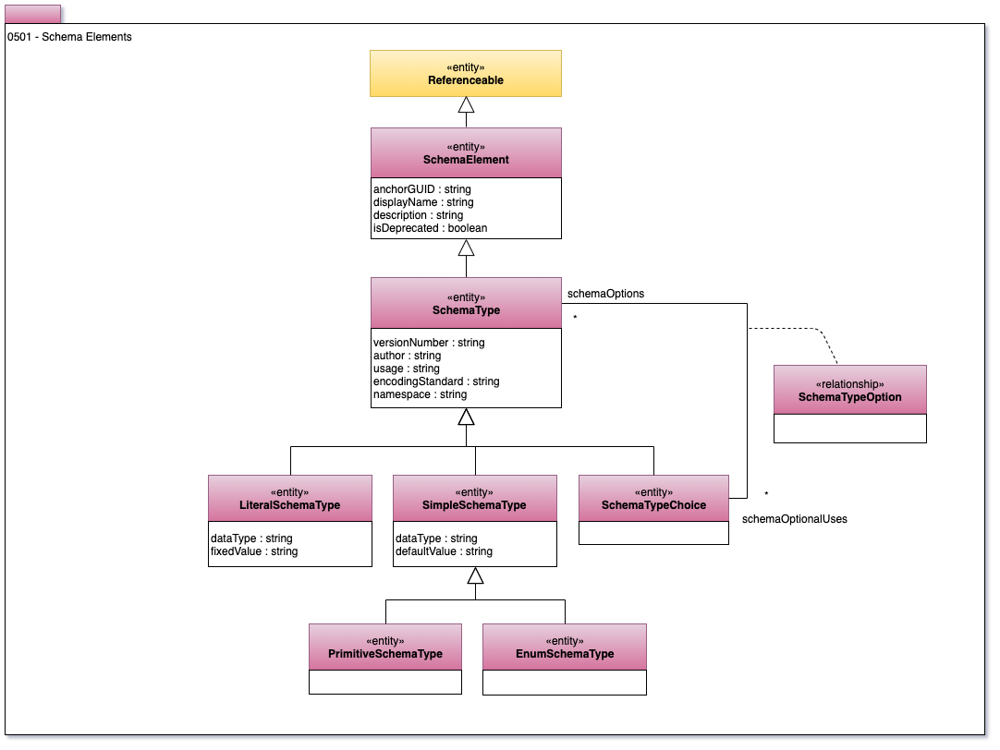

<!-- SPDX-License-Identifier: CC-BY-4.0 -->
<!-- Copyright Contributors to the ODPi Egeria project. -->

# 0501 Schema Elements

The schema used by data platforms to define the structure of data assets that are concrete physical
artifacts, are typically managed in a configuration management database.  There are many approaches.
XML and JSON documents have their schema built-into the data.
Relational databases use their own Data Definition Language (DDL) for defining the data structures in the database.  

For open metadata, we create an abstraction of these physical
schemas in order to understand the likely data elements stored
in the data asset so we can govern them.
Thus the open metadata types for schema do not exactly
follow the physical schema structure but have enough detail
to map the data elements.
There should be enough information in the open metadata types, however,
to regenerate a reasonable implementation of a physical schema
of a particular type.

**SchemaElement** describes the base definition for representing
schema elements in metadata.   The **SchemaType** describes the
top-level name of a schema and also the types of any fields nested in it.

Return to [Area 5](Area-5-models.md).

----
License: [CC BY 4.0](https://creativecommons.org/licenses/by/4.0/),
Copyright Contributors to the ODPi Egeria project.