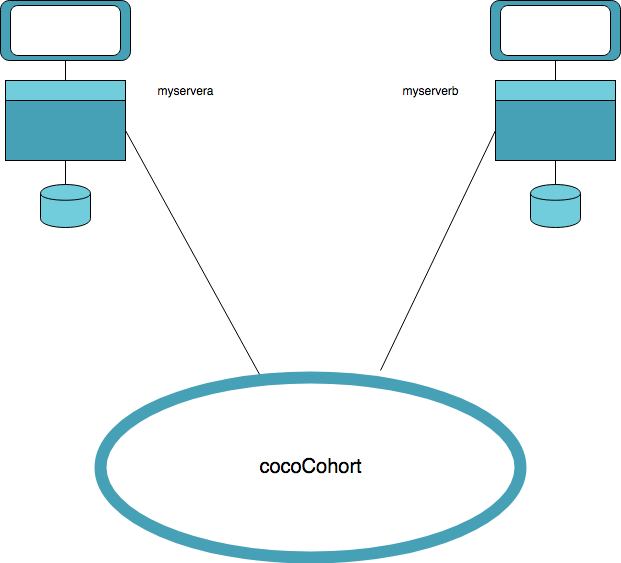
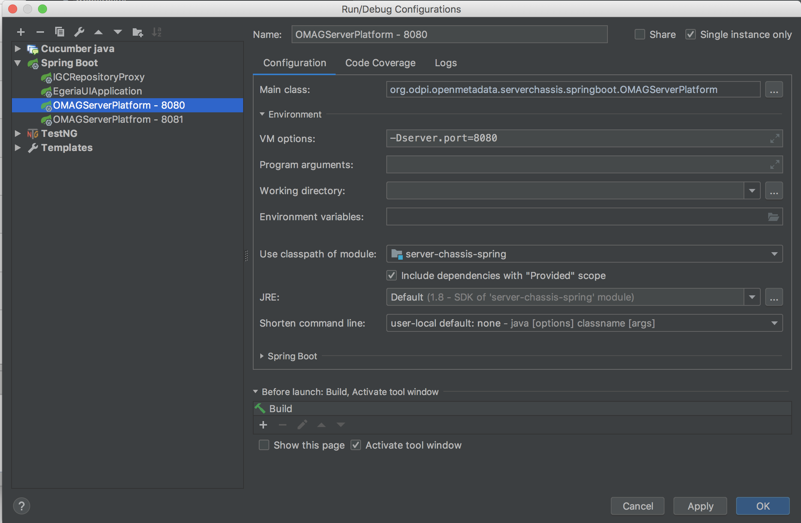

<!-- SPDX-License-Identifier: Apache-2.0 -->
<!-- Copyright Contributors to the ODPi Egeria project. -->

# Cohort demonstration using the Egeria In Memory Metadata Repository
  
In memory metadata repositories can be used with Egeria for demonstrations of Egeria capabilities without needing to install 
another metadata repository. This is <em>NOT</em> for production.



> Figure 1: Cohort set up for demo
        
    
## Docker    
This demo involves starting 2 [OMAG Server Platforms](../../../open-metadata-publication/website/omag-server)
each running logical server instances
called `myservera` and `myserverb` connected together as part of an
[open metadata repository cohort](../../../open-metadata-implementation/repository-services/docs/open-metadata-repository-cohort.md) called `cocoCohort`.
Apache Kafka is used to publish and consume events, resulting in the metadata being synchronised
between the 2 metadata repositories.

The demo uses [Apache Kafka](http://kafka.apache.org/) in a Docker container. See **[Kafka-Docker](Kafka-Docker.md)** for details on how to set this up   
  
## Egeria setup 
Start an OMAG server platform either from the
[Egeria install](../../open-metadata-tutorials/omag-server-tutorial/task-starting-omag-server.md) or from IntelliJ.

Here is the IntelliJ configuration for an OMAG server platform using port 8080. Note you should change to 9443 which is now the default for Egeria since switching to https by default


> Figure 2: OMAG Server Platform run configuration for port 8080

In a similar way start a second OMAG server platform on port 9444 using `-Dserver.port=9444`.

Issue the following REST calls

```
POST https://localhost:9443/open-metadata/admin-services/users/david/servers/myservera/event-bus
```

```json
{
  "producer":
  {
    "bootstrap.servers":"localhost:9092",
    "acks":"all",
    "retries":"0",
    "batch.size":"16384",
    "linger.ms":"1",
    "buffer.memory":"33554432",
    "max.request.size":"10485760",
    "key.serializer":"org.apache.kafka.common.serialization.StringSerializer",
    "value.serializer":"org.apache.kafka.common.serialization.StringSerializer",
    "kafka.omrs.topic.id":"cocoCohort"
  },
  "consumer":
  {
    "bootstrap.servers":"localhost:9092",
    "zookeeper.session.timeout.ms":"400",
    "zookeeper.sync.time.ms":"200",
    "fetch.message.max.bytes":"10485760",
    "max.partition.fetch.bytes":"10485760",
    "key.deserializer":"org.apache.kafka.common.serialization.StringDeserializer",
    "value.deserializer":"org.apache.kafka.common.serialization.StringDeserializer",
    "kafka.omrs.topic.id":"cocoCohort"
  }
}
```

```
POST https://localhost:9443/open-metadata/admin-services/users/david/servers/myservera/access-services
POST https://localhost:9443/open-metadata/admin-services/users/david/servers/myservera/cohorts/cocoCohort
POST https://localhost:9443/open-metadata/admin-services/users/david/servers/myservera/local-repository/mode/in-memory-repository
POST https://localhost:9443/open-metadata/admin-services/users/david/servers/myservera/instance
```

Wait for the last REST call to complete. If you have info logging om Kafka issues logging to the console for each publish of a type.

Repeat the above commands for OMAG server platform running `serverb`. 

```
POST https://localhost:9444/open-metadata/admin-services/users/david/servers/myserverb/...
```


## Using the Subject Area OMAS to test the synchronization
 
```
POST https://localhost:9443/servers/myservera/open-metadata/access-services/subject-area/users/david/glossaries
```
```json
{
  "class":"Taxonomy",
  "name":"Glossary2",
  "description":"test glossary 1 ",
  "usage":"usage A",
  "nodeType":"Taxonomy"
}
```

The response should be something like:

```json
{
    "class": "GlossaryResponse",
    "relatedHTTPCode": 200,
    "responseCategory": "Glossary",
    "glossary": {
        "nodeType": "Taxonomy",
        "name": "Glossary2",
        "systemAttributes": {
            "status": "ACTIVE",
            "createdBy": "david",
            "createTime": "2018-09-11T11:24:00.543+0000",
            "version": 1,
            "guid": "9b08873e-5317-4199-9c5e-a7213947f271"
        },
        "description": "test glossary 1 ",
        "classifications": [
            {
                "systemAttributes": {
                    "status": "ACTIVE",
                    "version": 0
                },
                "classificationName": "Taxonomy"
            }
        ],
        "governanceActions": {},
        "usage": "usage A"
    }
}
```

Note the guid and issue a get to other server (8081). 

```
GET https://localhost:9444/servers/myserverb/open-metadata/access-services/subject-area/users/david/glossaries/9b08873e-5317-4199-9c5e-a7213947f271
```          

You should get the glossary back. 

#### Working with Egeria 

Be aware that files are created for the config and registry store. They will be

```
omag.server.myservera.config
omag.server.myserverb.config
myservera.cocoCohort.registrystore
myserverb.cocoCohort.registrystore
```

If you want to start a clean system, you should delete these files and restart the servers.


----
License: [CC BY 4.0](https://creativecommons.org/licenses/by/4.0/),
Copyright Contributors to the ODPi Egeria project.
