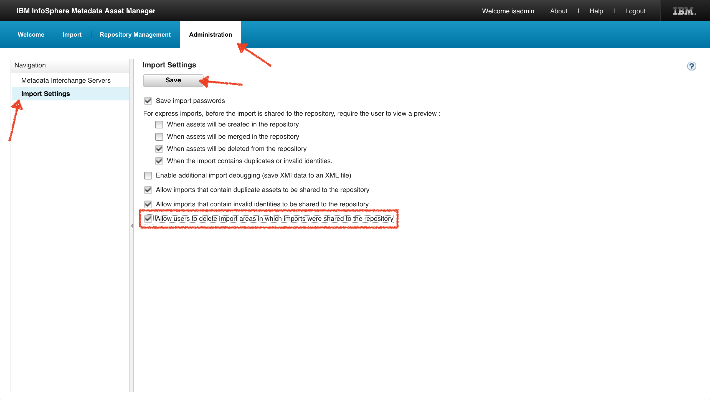

<!-- SPDX-License-Identifier: CC-BY-4.0 -->
<!-- Copyright Contributors to the ODPi Egeria project. -->

# Minimal

The Minimal samples provide a low volume set of examples for very basic initial testing purposes. For the moment
these are focused on efforts for testing lineage across various connectors, and are thus starting with a minimal
set of targets to which to deploy.

The samples themselves broadly fit into two categories:

- data: provided as both sample files and database tables
    - 1 database, currently only loadable to IBM DB2
    - 1 sample file (semi-colon separated CSV)
- metadata: provided as archives that can be loaded into one or more metadata repositories
    - 2 sample IBM DataStage jobs (currently only loadable to IBM Information Server):
        - 1 job loading from (input) file to table
        - 1 job loading from table to (output) file

## Requirements

If you want to make use of a pre-existing IBM InfoSphere Information Governance Catalog
repository, you will need:

- Ansible v2.4.x (ideally the latest v2.7.x+)
- Network access to the IBM Information Server environment
- Inventory group names setup the same as `IBM.infosvr` role
- Following Ansible roles installed:
  - [IBM.infosvr](https://galaxy.ansible.com/IBM/infosvr)
  - [IBM.infosvr-metadata-asset-manager](https://galaxy.ansible.com/IBM/infosvr-metadata-asset-manager)
  - [IBM.infosvr-import-export](https://galaxy.ansible.com/IBM/infosvr-import-export)

**Important**: Begin by reviewing the sample inventory (`hosts.sample`) and default configuration (`defaults/main.yml`), and
make any changes necessary to represent your own environment.  In particular:

- Create your own inventory (eg. `hosts`), placing your own host name(s) within it (using `hosts.sample` as a template)
- Replace the credentials in the `defaults/main.yml` file, ie. for the database user

## General deployment ordering

For repeatability, ie. to achieve the same starting point each time, follow this general ordering for deployment:

1. Shutdown your OMAG Server Platform that will run the IGC connector (proxy).
1. Empty your OMRS Kafka topic.
1. Remove your OMAG Server Platform configuration files (`*.config`, `*.registrystore`).
1. Run the samples removal script (see "Removing the samples from your environment" below) against your IBM Information
    Server environment.
1. Start your OMAG Server Platform.
1. Configure the IGC connector (proxy) in the OMAG Server Platform.
1. Run the samples deployment script (see "Loading the samples to your environment" below) against your IBM Information
    Server environment.

Should you want to "reset" your environment, simply re-run these steps.

(While you can likely skip some of the first steps the first time you run the samples deployment, it will
not harm anything to run them if your environment is empty -- so the safest approach is to always run all
of the steps.)

## Loading the samples to your environment

Assuming you have configured the settings as listed under "Requirements" above, run the `deploy.yml` playbook to
deploy everything (using Ansible):

```shell script
$ ansible-playbook -i hosts deploy.yml
```

If you have configured the [IGC Repository Connector](https://github.com/odpi/egeria-connector-ibm-information-server)
in advance of running the playbook, including the event mapper configuration, you will also
see events published into the cohort for these samples as well as part of the load process.

## Removing the samples from your environment

A removal playbook is also provided to clean the samples from your environment, allowing you
to repeat the load process if you so desire.

Again, assuming you have configured the settings as listed under "Requirements" above, run the removal playbook as
follows:

```bash
ansible-playbook -i hosts remove.yml
```

Note that to fully remove artifacts from an IGC environment you must also allow import areas to
be deleted from IBM Metadata Asset Manager. This requires a manual configuration change as follows
(which must be completed before running the removal playbook):



1. Navigate to the "Administration" tab.
1. Open the "Import Settings" under Navigation.
1. Tick the box next to "Allow users to delete import areas in which imports were shared to the repository".
1. Click the "Save" button.

The following metadata will also remain, as it cannot be deleted via API.  You can either leave it
(it will not impact re-deploying) or you can manually delete it from the environment using the appropriate
client.

- The local file system data connection (can only be deleted via Metadata Asset Manager)
- The database data connection (can only be deleted via Metadata Asset Manager)

----
License: [CC BY 4.0](https://creativecommons.org/licenses/by/4.0/),
Copyright Contributors to the ODPi Egeria project.
